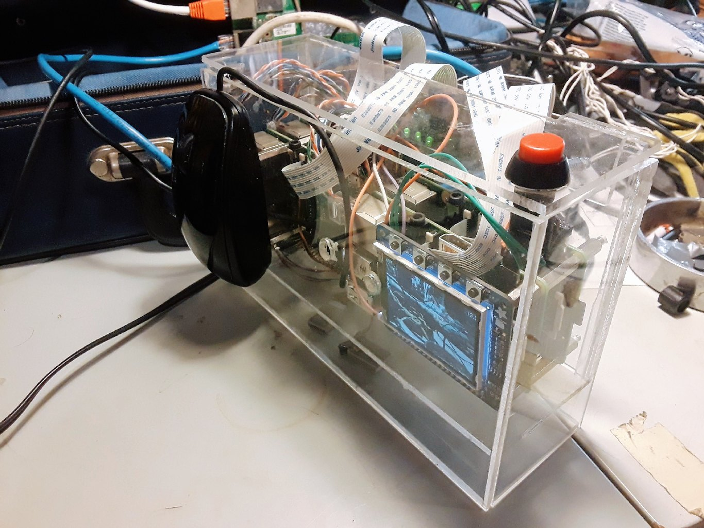
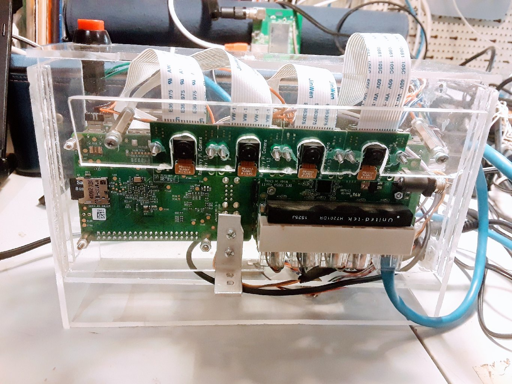

# Quadroscope

A four cameara raspberry stack system. It is supposed to create 
animated GIFs out of 4 simultaneously created pictures shot by 4
separate raspberry pi cameras.

# Installation & environment

- Get a raspberry image.
- Write it on a card
- install python, git
TODO: collect pip dependencies
- check the code out
- generate an ssh key for the `root` (!!!) user of boss
    - NOTE: the raspberries have to know each other in order to be able to upload/download files from each other
- link up the other raspberries
- exchange ssh keys with `ssh-copy-id` so you can log in seamlessly!
- peferably set a descriptive name for each raspberry in `/etc/hostname` so you can use that in `employees.json`
- set up config files in `config` folder by the examples

# Troubleshooting

- I get `pygame.error: video system not initialized`: did you try to run it with `sudo`?

# Notes

- The 4 separate raspberries are linked via a dlink switch, because that was the most
convinient way to link them
- The reason 4 separate board is needed is that the boards only support 1 camera at a time.
- there are many hacky solutions, this is a prototype
- there are 3 slave and 1 master raspberry. The master has the GUI running on the linked 2,2 tft screen. 
- timing is solved through 3 separate GPIO channels being sent out by the master PI. 
This is because one GPIO output has problem driving 3 different PI's input.

# tools & useful commands

ssh into boss.

Run `./log` to see the live output of all the cameras.

# disclaimer
=======
# Disclaimer
>>>>>>> e92d1372b7f9709381dce8ca17334731de048176

- This is my first python project.

Created in [MeetLab](http://meetlab.hu) Budapest

